# 网络安全

---
>北京航空航天大学

## 计算机网络基础

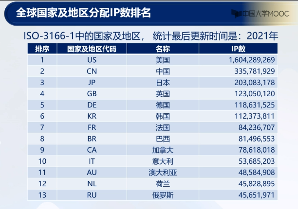

## Internet 协议的安全性

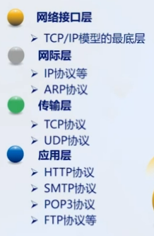

### 网际层协议

#### IP协议

网际协议(Internet Protocol,IP)是TCP/IP协议族 的核心，也是网际层最重要的协议。

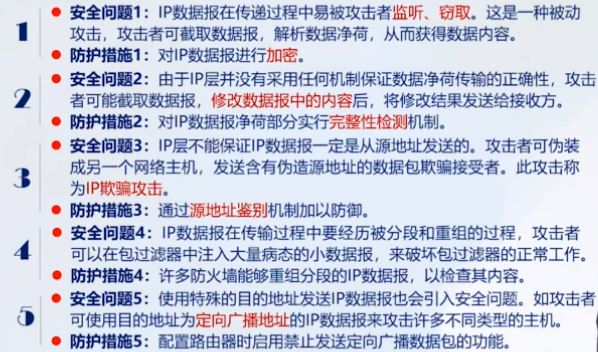

#### arp协议

arp欺骗 防范措施：在交换机上配置IEEE 802.1x协议

#### ICMP协议

1.安全问题：ICMP重定向攻击
攻击者可以利用ICMP对消息进行重定向，使得目标机器遭受连接劫持和拒绝服务等攻击。
重定向消息应该仅由产生消息的主机或路由器执行，网管员不应使用ICMP创建通往目的地的新路由

2.安全问题：ICMP路由器发现攻击
在进行路由发现时，ICMP并不对应答方进行认证，使得它可能遭受严重的中间人攻击。攻击者假冒正常的路由器，使用伪造信息应答ICMP询问。由于ICMP并不对应答方进行认证，因此接收方无法知道响应是伪造的。

3.安全问题：防火墙穿越攻击
通过防火墙穿越攻击技术（Firewalking），攻击者能够穿越某个防火墙的访问控制列表和规则集，进而确定该防火墙过滤的内容和具体的过滤方式。尽管防火墙面临启用ICMP所带来的风险，但由于主机采用Path MTU的机制，因此在防火墙封堵所有ICMP消息并不妥当。

#### IGMP协议

#### OFPS协议

开放最短路径优先协议（Open Shortest Path First, OSPF）是一个内部网关协议，用于在单一自治系统内决策路由。

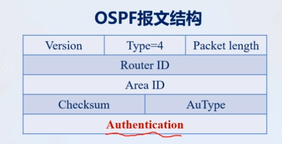

#### BGP协议

边界网关协议（Border Gateway Protocol, BGP）是一个自治系统间的路由选择协议。

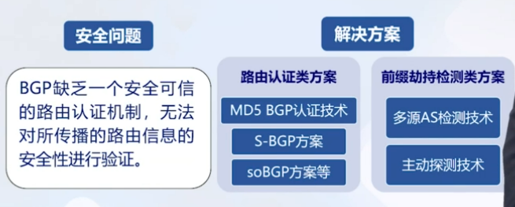

### 传输层协议

#### TCP协议

🚨 1. SYN Flood 攻击（半开连接攻击）
原理：
攻击者伪造大量源IP地址，向目标服务器发送大量TCP的SYN连接请求。

服务器分配资源并回复SYN-ACK，等待ACK确认，但攻击者不响应。

大量“半开连接”挂在服务器上，占用资源，最终导致拒绝服务（DoS）。

特点：
不需要建立完整连接；

攻击成本低；

可用防火墙或SYN cookie缓解。

🎭 2. TCP会话劫持（Session Hijacking）
原理：
攻击者猜测或嗅探某TCP连接的序列号（Sequence Number）。

然后伪装成其中一方发送数据，使通信被中断或篡改。

应用场景：
在无加密的Telnet、FTP等协议中容易实现；

常配合ARP欺骗或IP欺骗。

🧱 3. TCP RST攻击（重置连接）
原理：
攻击者发送伪造的TCP RST（重置）报文到通信双方，迫使连接断开。

应用：
中断SSH、Telnet等持久连接；

早期用于干扰BT、电驴等P2P连接。

🪞 4. TCP/IP Spoofing（IP地址伪造）
原理：
攻击者伪造源IP地址进行TCP连接；

可配合SYN Flood或Session Hijacking攻击使用。

📡 5. TCP ACK Flood攻击
原理：
发送大量伪造的TCP ACK包，触发防火墙、IDS等设备频繁处理。

虽不会建立连接，但仍消耗资源，属于DDoS攻击的一种。

🧨 6. TCP慢速攻击（Slowloris变种）
原理：
攻击者保持连接不关闭，但非常缓慢地发送数据。

服务器长时间保持连接状态，最终资源耗尽。

| 威胁类型          | 防御方法                                                      |
| ----------------- | ------------------------------------------------------------- |
| SYN Flood         | 启用 SYN Cookie，限制半连接队列大小，部署防火墙或DDoS防护系统 |
| Session Hijacking | 启用TLS/SSL加密，使用随机序列号                               |
| RST攻击           | 配置防火墙过滤异常RST包，增强TCP栈校验                        |
| ACK Flood         | 检测非正常连接状态包速率，部署IPS                             |
| Slow攻击          | 设置连接超时时间，加速资源回收                                |

### 应用层协议

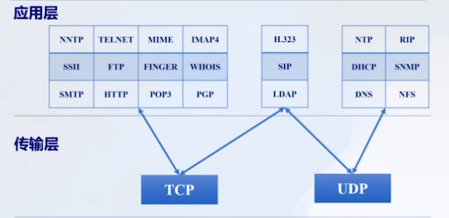

#### RIP协议 (端口：UDP520)

动态路由选择协议(Routing Information Protocol, RIP）是一种动态内部路由/网关协议，用于自治系统内的路由信息的传递。

#### HTTP协议（端口：TCP80)

超文本传输协议(Hyper Text Transfer Protocol,HTTP) 是一个客户端和服务器端请求和应答的标准，是互联网上应用最广泛的一种网络协议。

#### TELNET协议（端口：TCP23）

远程登录协议(Teletype Network,TELNET)是TCP/IP 协议族中的一员，是Internet远程登录服务的标准协议和主要方式。

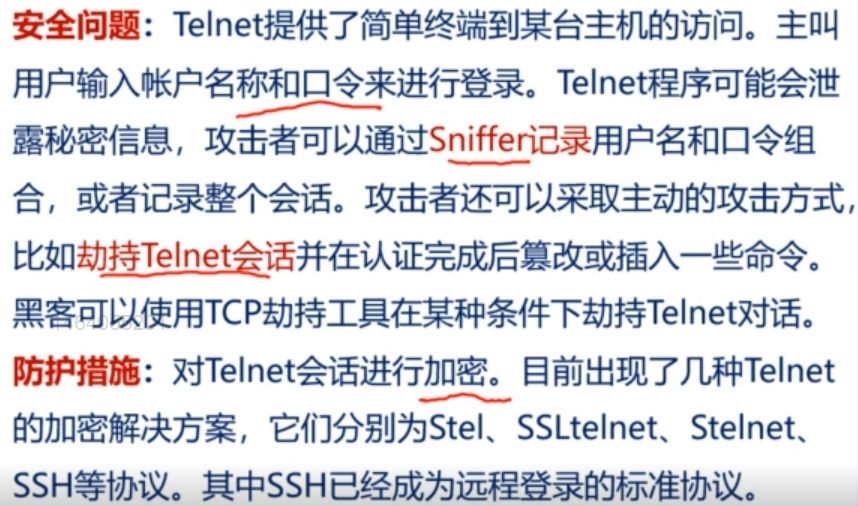

#### SSH协议（端口：TCP 22）

安全壳协议（Secure Shell，SSH）是一种在不安全的网络上建立安全的远程登录或其他安全网络服务的协议。

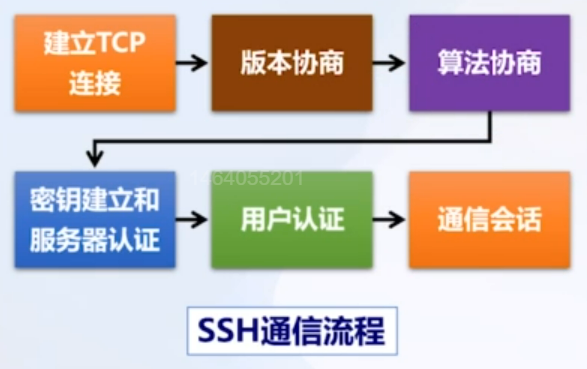

#### DNS协议（端口：UDP 53）

域名系统(Domain Name System,DNS)是一个分布式 数据库系统，用来实现域名与IP地址之间的映射。

#### SMTP协议（端口：TCP 25）

简单邮件传输协议(Simple Mail Transfer Protocol,SMTP) 是一组用于由源地址到目的地址传送邮件的规则，由它来控制信件的中转方式。

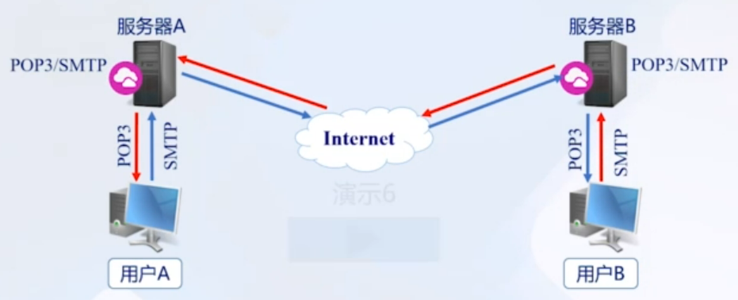

#### MIME协议

1464055201 多用途网间邮件扩充协议(Multipurpose Internet E-mail Extention, MIME）是广泛应用的一种电子邮件技术规范。

#### POP3协议（端口：TCP110)

邮局协议(Post Office Protocol,POP)是一个邮件协议 它的第3个版本称为POP3。

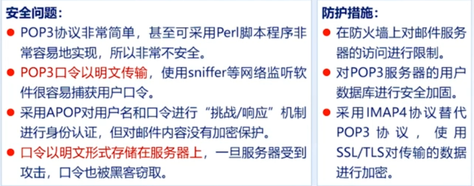

#### IMAP4协议（端口：TCP 143,993）

消息访问协议(Internet Message Access Protocol,IMAP)是 一个邮件获取协议，第4个版本是IMAP4。

#### PGP协议

PGP(Pretty Good Privacy)协议是常用的安全电子邮件标准。 PGP包括5种服务：认证、保密、压缩、电子邮件兼容和分段。

#### FTP协议（端口：TCP 20/21）

文件传输协议(File Transfer Protocol,FTP)是Internet文件传送 的基础，是TCP/IP协议族的重要协议之一。

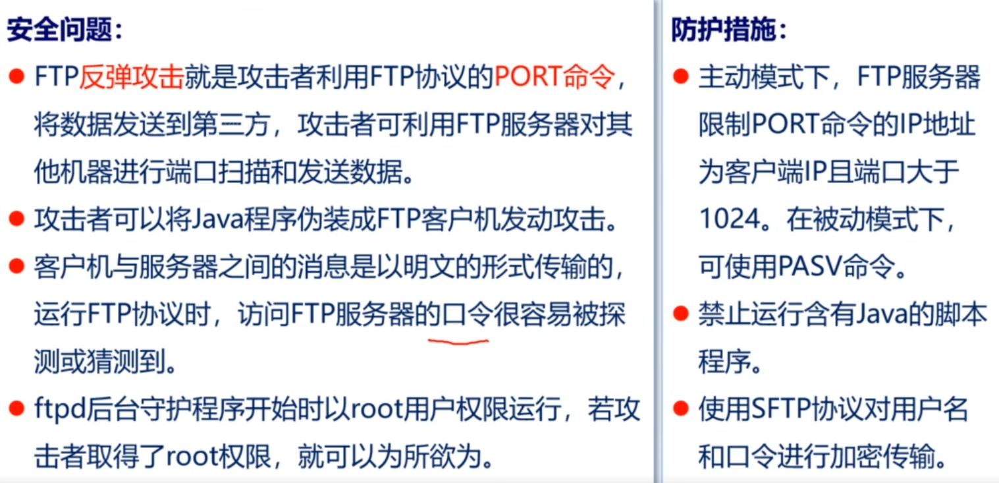

#### TFTP协议（端口：UDP 69）

简单文件传输协议(Trivial File Transfer Protocol,TFTP)是用来 在客户机与服务器之间进行简单文件传输的协议。

#### NFS协议（端口：UDP 2049）

国大学MOOC 网络文件系统(Network File System,NFS)是一个基于TCP/IP网 络的文件共享协议。

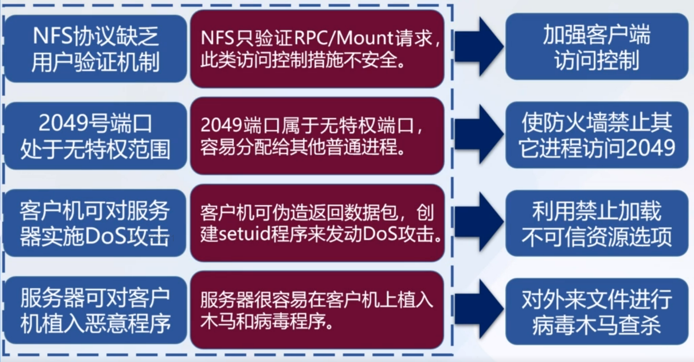

#### SNMP协议（端口：UDP 161/162）

简单网络管理协议（Simple Network Management Protocol, SNMP）是用于支持网络管理系统的协议。

#### DHCP协议（端口：UDP 67/68）

动态主机配置协议（Dynamic Host Configuration Protocol, DHCP）用于分配IP地址、提供启动计算机其他信息的协议。

#### H.323协议

H.323是一种用于VoIP(Voice over IP)在分组网上提供实 时音频、视频和数据通信的标准（NetMeeting）。

#### SIP协议

会话启动协议（Session Initiation Protocol， SIP）是由IETF制定的基于文本编码的多媒体通信协议（如VoLTE）。

#### NTP协议（端口：UDP 123）

网络时间协议(Network Time Protocol,NTP)可在分布式 时间服务器和客户端之间进行时间同步。

#### FINGER协议（端口：UDP 79）

Finger协议可以帮助用户查询系统中某一个用户的细节，如其全名、住址、电话号码、登录细节等。

#### Whois协议（端口：TCP 43）

Whois协议是用来查询域名的IP以及所有者等信息的传输协议。

#### LDAP协议（端口：TCP 389）

轻量级目录访问协议（Lightweight Directory Access Protocol, LDAP）是基于X.500的目录访问协议，以目录的形式来管理资源。

#### NNTP协议（端口：TCP 119）

网络新闻传输协议(Network News Transfer Protocol, NNTP) 是一个用于阅读和张贴新闻文章到Usenet上的Internet应用协议。

## 单私钥密码体制

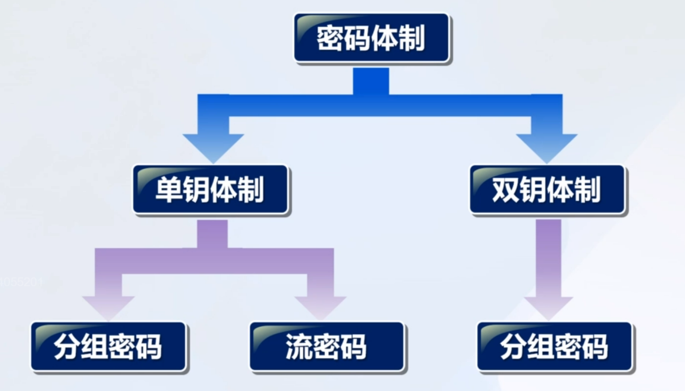

### 单表代换

凯撒密码

### 多表代换

维基尼亚密码

###

DES

AES

## 双钥密码体制

公钥（public key）---> 密文 ---> 私钥（private key）

### RSA 加密算法

RSA算法是一种非对称加密算法，由 Rivest、Shamir 和 Adleman 于1977年提出，名字就来自三位作者的首字母。它是现代加密通信、数字签名等领域的核心技术之一。

**核心原理**
RSA的安全性基于一个数学难题：大整数的素因数分解问题。

**加密/解密流程**
密钥生成：

1. 选择两个大素数 $p, q$
2. 计算 $n = p \times q$（模数）
3. 计算 $\varphi(n) = (p-1)(q-1)$
4. 选择一个整数 $e$，满足 $1 < e < \varphi(n)$，且 $\gcd(e, \varphi(n)) = 1$
5. 计算 $d$，使得 $ed \equiv 1 \mod \varphi(n)$（即 $d$ 是 $e$ 模 $\varphi(n)$ 的乘法逆元）

最终：

* 公钥：$(e, n)$
* 私钥：$(d, n)$

加密过程:

设明文是整数 $M$，满足 $0 < M < n$：

$$
C = M^e \mod n
$$

解密过程：

$$
M = C^d \mod n
$$

### Elgamal 加密算法

---

ElGamal 是 “用对数难题保密，用模幂保证安全”的加密方式。它使用一个随机数保护每次加密过程，从而实现 概率加密 —— 同样的明文加密多次，密文也不同。

#### 1️⃣ 公共参数

* $p$：一个大素数
* $g$：一个生成元（模 $p$ 的原根）

#### 2️⃣ 密钥生成

* 私钥：一个随机整数 $x \in [1, p-2]$
* 公钥：$y = g^x \mod p$

---

#### 🔐 加密过程（加密明文 $m$）

1. 选取一个随机数 $k \in [1, p-2]$
2. 计算：

   * $c_1 = g^k \mod p$
   * $c_2 = m \cdot y^k \mod p$
3. 输出密文对：$(c_1, c_2)$

---

#### 🔓 解密过程

1. 计算 $s = c_1^x \mod p$
2. 计算其逆元 $s^{-1} \mod p$
3. 明文恢复为：

   $$
   m = c_2 \cdot s^{-1} \mod p
   $$

### SM2

## 杂凑函数

## 数字签名

## 密码协议

$$
$$

## 网络加密与密钥管理

## 无线网络安全

### 无线无线蜂窝

| 安全功能          | 2G  | 3G  | 4G  | 5G  |
| ----------------- | --- | --- | --- | --- |
| 无线信道加密      | √   | √   | √   | √   |
| 用户-网络双向认证 |     | √   | √   | √   |
| 完整性保护        |     | √   | √   | √   |
| 层次化密钥管理    |     |     | √   | √   |
| 身份标识隐私保护  |     |     |     | √   |

### 超低轨卫星

## 13. 入侵检测技术

## 14. VPN技术

### VPN概述

### 隧道协议与VPN

### IPSec VPN

### SSL/TLS VPN

### PPTP VPN

### MPLS VPN
